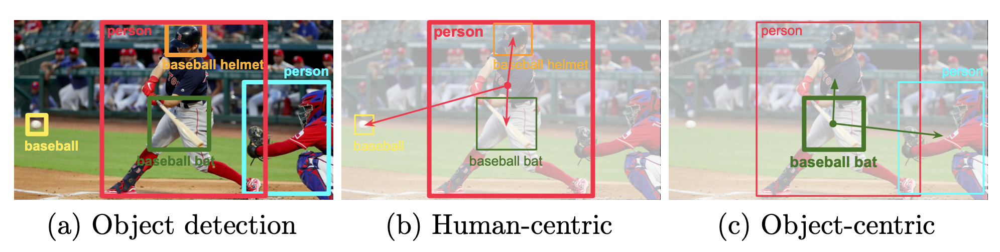

# DRG: Dual Relation Graph for Human-Object Interaction Detection
Official Pytorch implementation for [DRG: Dual Relation Graph for Human-Object Interaction Detection (ECCV 2020)](https://www.ecva.net/papers/eccv_2020/papers_ECCV/papers/123570681.pdf).

See the [project page](http://chengao.vision/DRG/) for more details. Please contact Jiarui Xu (jiaruixu@vt.edu) if you have any questions related to implementation details.



### Prerequisites
This codebase was tested with Python 3.6, Pytorch 1.0 from a nightly release, CUDA 10.0, and CentOS 7.4.1708.

### Installation
Please check [INSTALL.md](INSTALL.md) for installation instructions.

### Data Downloads
Download V-COCO and HICO-DET data. Setup HICO-DET evaluation code.
```Shell
bash ./scripts/download_dataset.sh 
bash ./scripts/download_data.sh
```

### Evaluation
1. Download DRG detections and data
    ```Shell
    bash ./scripts/download_drg_detection.sh
    ```

2. Evaluate on VCOCO
    ```Shell
    python tools/vcoco_compute_mAP.py \
        --dataset_name vcoco_test \
        --detection_file output/VCOCO/detection_merged_human_object_app.pkl
    ```

3. Evaluate on HICO-DET
    ```Shell
    cd Data/ho-rcnn
    matlab -r "Generate_detection('COCO'); quit"
    cd ../../
    ```

4. Evaluate on HICO-DET finetuned detection
    ```Shell
    cd Data/ho-rcnn
    matlab -r "Generate_detection('finetune'); quit"
    cd ../../
    ```

### Train
0. Down pre-trained Faster R-CNN model weights for initialization
    ```Shell
    bash ./scripts/download_frcnn.sh
    ```

1. Train on V-COCO
    ```Shell
    bash ./scripts/train_VCOCO.sh
    ```

2. Train on HICO-DET
    ```Shell
    bash ./scripts/train_HICO.sh
    ```

### Test
1. Test on V-COCO
    ```Shell
    bash ./scripts/test_VCOCO.sh $APP_ITER_NUMBER $HUMAN_SP_ITER_NUMBER $OBJECT_SP_ITER_NUMBER
    ```

2. Test on HICO-DET
    ```Shell
    bash ./scripts/test_HICO.sh $APP_ITER_NUMBER $HUMAN_SP_ITER_NUMBER $OBJECT_SP_ITER_NUMBER
    ```

### DRG Pretrained Weights
Download DRG trained weights.
```Shell
bash ./scripts/download_drg_models.sh
```

### Object Detection
For a simple demo, you can try
```Shell
python demo/demo_obj_det.py
```
Currently, we only support Faster R-CNN with ResNet-R50-FPN backbone.

### TODO
- [ ] Video demo generation code

### Citation
If you find this code useful for your research, please consider citing the following papers:

	@inproceedings{Gao-ECCV-DRG,
	    author    = {Gao, Chen and Xu, Jiarui and Zou, Yuliang and Huang, Jia-Bin}, 
	    title     = {DRG: Dual Relation Graph for Human-Object Interaction Detection}, 
	    booktitle = {European Conference on Computer Vision},
	    year      = {2020}
	}

	@inproceedings{gao2018ican,
	    author    = {Gao, Chen and Zou, Yuliang and Huang, Jia-Bin}, 
	    title     = {iCAN: Instance-Centric Attention Network for Human-Object Interaction Detection}, 
	    booktitle = {British Machine Vision Conference},
	    year      = {2018}
	}

### Acknowledgement
This code follows the implementation architecture of [maskrcnn-benchmark](https://github.com/facebookresearch/maskrcnn-benchmark), [iCAN](https://github.com/vt-vl-lab/iCAN) and [No Frills](https://github.com/BigRedT/no_frills_hoi_det).
